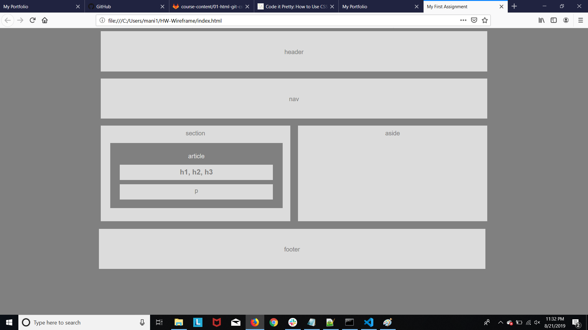

# HW-Wireframe

## Site picture

## Technologies Used
- HTML : used to create elements on the DOM
- CSS  : Styles html elements on page
- Git : version control system to track changes to source code
- GitHub : hosts repository that can be deployed to GitHub pages

## Summary
### Built a web design skeleton using HTML/CSS. Applied different styles and aligned website in a neat manner. Similar to the code snippet added below aligned and styled rest HTML tags.

## Code Snippet
```HTML
<header>
        <div id="header" name="headerTag" style=background-color:gainsboro align="center"
            style="border:1px solid white">
            <p id="h3">header</p>
        </div>
</header>
```


## Author Links
[LinkedIn](https://www.linkedin.com/feed/)

[GitHub](https://github.com/Mahi-Mani)

